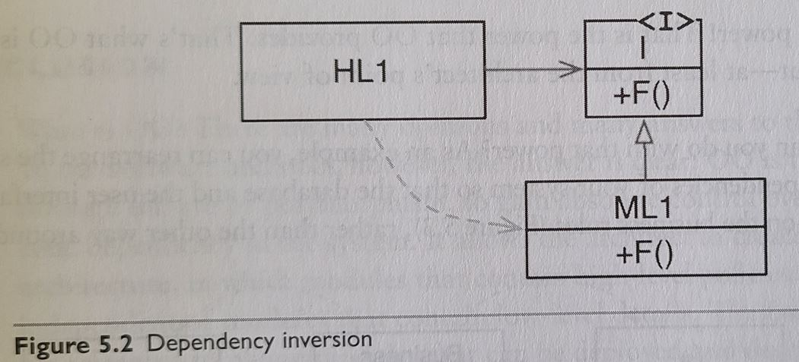
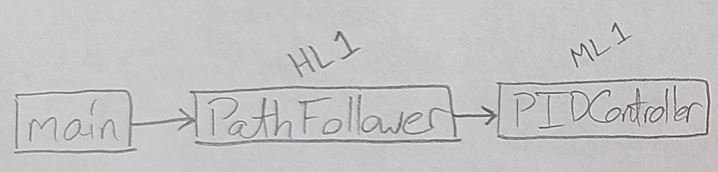
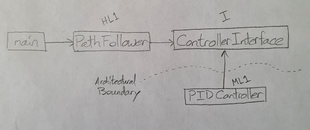

# Dependency Inversion Principle (DIP)
**Clean Architecture by Robert Martin** states, "Any source code dependency, no matter where it is can be inverted." This is known as the Dependency Inversion Principle (DIP), which is illustrated in the first diagram. Martin argues that this is the primary benefit of Object-Oriented Programming.

He states, "It allows the architect to create a plugin architecture, in which modules that contain high-level policies are independent of modules that contain low-level details."

### DIP Diagram from Clean Architecture


# Robotics Example

To illustrate this point, we can create two fictional classes:
- **PathFollower:** A high-level class for directing overall robot motion.
- **PIDController:** A mid-level class for controlling wheel velocity.

A naive implementation of how we might design these classes is shown in the second diagram.
### Naive Implemention (without dependency inversion):


The dependency-inverted implementation is shown in the third diagram. Notice that `PathFollower` does not inherit from `PIDController` directly.

### Dependency Inverted Implementation


A few consequences of this inversion are:
- Any controller that adheres to the interface (an abstract class) defined by `ControllerInterface` can be swapped in with minimal effort.
- `PathFollower` doesn't need to be recompiled if `PIDController` change.
- As promised above, "high-level policies (`PathFollower`) are independent of modules that contain low-level details (`PIDController`).
- Both modules (`PathFollower` and `PIDController`) depend on abstractions, not implementation details.

C++ and Python examples of both the Naive and DIP implementations were built using the references linked below.

## C++
In C++, an abstract class with virtual methods defines an interface (e.g., `ControllerInterface`) which specifies a contract that all concrete implementations of that abstract class (e.g., `PIDController`) must meet.

To compile:
```
cd dependency-inversion
mkdir build && cd build
cmake ..
make -j4
```
To run the naive example:
```
cd dependency-inversion/build
./naive_approach
```
To run the dependency inverted example:
```
cd dependency-inversion/build
./di_approach
```
## Python
In Python, an abstract (`ABC`) class with `@abstractmethod` methods defines an interface (e.g., `ControllerInterface`) which specifies a contract that all concrete implementations of that abstract class (e.g., `PIDController`) must meet.

To run the naive example:
```
cd dependency-inversion/python
python naive.py
```
To run the dependency inverted example:
```
cd dependency-inversion/python
python di_approach.py
```

# References
- C++
    - http://codingadventures.org/2021/10/16/dependency-inversion-in-c/
    - https://github.com/plusangel/DependencyInversion_pattern_cpp
- Python
    - https://youtu.be/Kv5jhbSkqLE
    - https://github.com/ArjanCodes/betterpython/tree/main/2%20-%20dependency%20inversion
